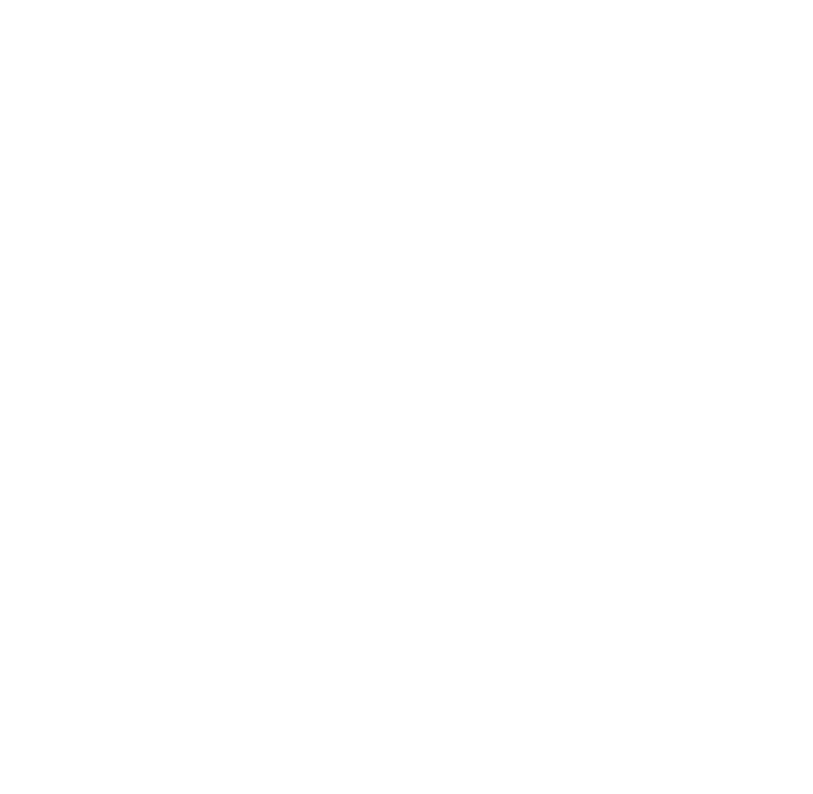

<div align="center">



# Red Door Pizza

**Authentic Wood-Fired Pizza in Buninyong, Victoria**

[](https://nextjs.org/)
[](https://react.dev/)
[](https://www.typescriptlang.org/)
[](https://tailwindcss.com/)
[](#license)

A production-ready, SEO-optimized website for Red Door Pizza — a premium wood-fired pizzeria in historic Buninyong, VIC. Built with modern web technologies for performance, accessibility, and conversion.

[Live Site](https://www.reddoorpizza.com.au) · [Order Online](https://orders.wowapps.com/order/reddoorpizzeria) · [Contact](https://www.reddoorpizza.com.au/contact)

---

</div>

## Table of Contents

- [About](#about)
- [Tech Stack](#tech-stack)
- [Features](#features)
- [Getting Started](#getting-started)
  - [Prerequisites](#prerequisites)
  - [Installation](#installation)
  - [Development](#development)
  - [Production Build](#production-build)
- [Project Structure](#project-structure)
- [Configuration](#configuration)
- [Architecture](#architecture)
- [SEO & Performance](#seo--performance)
- [Deployment](#deployment)
- [Contributing](#contributing)
- [License](#license)
- [Contact](#contact)

---

## About

**Red Door Pizza** is a locally owned wood-fired pizzeria at 401 Warrenheip St, Buninyong VIC 3357. This website serves as the primary digital presence — showcasing the menu, enabling online ordering via WowApps, facilitating table bookings, and promoting private function hosting.

**Rating:** 4.6 stars in Buninyong

---

## Tech Stack

| Category | Technology |
|---|---|
| **Framework** | [Next.js 16](https://nextjs.org/) (App Router) |
| **UI Library** | [React 19](https://react.dev/) |
| **Language** | [TypeScript 5](https://www.typescriptlang.org/) |
| **Styling** | [Tailwind CSS 4](https://tailwindcss.com/) |
| **Animations** | [Framer Motion 13](https://www.framer.com/motion/) |
| **Icons** | [Lucide React](https://lucide.dev/) |
| **Fonts** | [Inter](https://vercel.com/font) (Sans) + [Playfair Display](https://vercel.com/font) (Serif) via `next/font` |
| **Linting** | [ESLint 9](https://eslint.org/) (Next.js Core Web Vitals + TypeScript) |
| **Online Ordering** | [WowApps](https://wowapps.com/) (third-party integration) |

---

## Features

### Customer-Facing
- **Full Menu Display** — Categorized menu with filtering (Pizzas, Starters, Pasta, Kids, Desserts, Drinks)
- **Online Ordering** — Direct integration with WowApps for pickup/delivery
- **Table Booking** — SMS-based enquiry form for reservations
- **Private Functions** — Event inquiry form with guest count, event type, and date selection
- **Outdoor Dining Showcase** — Dedicated section highlighting the beer garden courtyard
- **Customer Testimonials** — Social proof with star ratings
- **FAQ Section** — Expandable accordion with 10 common questions
- **Photo Gallery** — 10-image responsive grid showcasing the venue
- **Lunch Special Promotion** — Persistent announcement bar for $23 pizza deal (Fri–Sun, 12–3 PM)

### Technical
- **SEO Optimized** — JSON-LD structured data (Restaurant schema), meta tags, semantic HTML
- **Responsive Design** — Mobile-first with dedicated mobile sticky nav and hamburger menu
- **Smooth Animations** — Scroll-triggered and page transition animations via Framer Motion
- **Performance** — Image optimization with `next/image`, font optimization with `next/font`
- **Legal Pages** — Full Terms & Conditions and Privacy Policy pages
- **Accessibility** — Semantic HTML, ARIA labels, keyboard navigation support
- **Custom Brand System** — Tailwind CSS theme with brand colors (terracotta, gold, charcoal)

---

## Getting Started

### Prerequisites

- **Node.js** 18.17+ (recommended: 20 LTS)
- **npm** 9+ (or yarn/pnpm/bun)
- **Git**

### Installation

```bash
# Clone the repository
git clone https://github.com/reddoorpizza/reddoorpizza.git
cd reddoorpizza

# Install dependencies
npm install
```

### Development

```bash
npm run dev
```

Open [http://localhost:3000](http://localhost:3000) in your browser.

The page auto-updates as you edit files. Edits to `app/` directory will trigger hot reload.

### Production Build

```bash
# Build for production
npm run build

# Start production server
npm start
```

### Linting

```bash
npm run lint
```

---

## Project Structure

```
reddoorpizza/
├── app/
│   ├── components/           # Reusable UI components
│   │   ├── AnnouncementBar.tsx    # Top promo bar ($23 lunch special)
│   │   ├── ContactSection.tsx     # Contact info + order CTA
│   │   ├── FAQSection.tsx         # Expandable FAQ accordion
│   │   ├── FloatingOrderButton.tsx # Desktop floating CTA
│   │   ├── Footer.tsx             # Site footer with links & socials
│   │   ├── FunctionsSection.tsx   # Private events inquiry
│   │   ├── GallerySection.tsx     # Photo gallery grid
│   │   ├── Header.tsx             # Desktop & mobile header
│   │   ├── Hero.tsx               # Full-screen hero with CTA
│   │   ├── MenuSection.tsx        # Filterable menu display
│   │   ├── MobileStickyNav.tsx    # Mobile bottom navigation
│   │   ├── OutdoorDiningSection.tsx # Beer garden showcase
│   │   ├── TestimonialsSection.tsx # Customer reviews
│   │   └── USPSection.tsx         # Unique selling points
│   ├── config/
│   │   └── constants.ts          # Centralized configuration
│   ├── contact/
│   │   ├── EnquiryForm.tsx       # SMS-based contact form
│   │   └── page.tsx              # Contact page
│   ├── privacy/
│   │   └── page.tsx              # Privacy policy
│   ├── terms/
│   │   └── page.tsx              # Terms & conditions
│   ├── globals.css               # Global styles + Tailwind theme
│   ├── layout.tsx                # Root layout (fonts, SEO, JSON-LD)
│   └── page.tsx                  # Home page
├── public/
│   ├── Gallery/                  # Gallery images (img-1..10.webp)
│   ├── Banner.jpg                # Hero background
│   ├── logo.png                  # Brand logo
│   ├── favicon-*.png             # Favicons (192, 512)
│   └── OUTDOOR DINING.JPG        # Courtyard photo
├── .gitignore
├── eslint.config.mjs
├── next.config.ts
├── package.json
├── postcss.config.mjs
├── tsconfig.json
└── README.md
```

---

## Configuration

### Environment Variables

This project uses a centralized config system. Key values are defined in `app/config/constants.ts`:

```typescript
// Online ordering URL (WowApps)
export const WOWAPPS_ORDER_URL =
  "https://orders.wowapps.com/order/reddoorpizzeria";
```

### Tailwind CSS Theme

Brand colors are defined in `app/globals.css`:

| Token | Hex | Usage |
|---|---|---|
| `brand-terracotta` | `#ac511a` | Primary CTA, accents |
| `brand-terracotta-dark` | `#8a4015` | Hover states |
| `brand-gold` | `#eccb57` | Highlights, badges |
| `brand-offwhite` | `#FAF8F5` | Page backgrounds |
| `brand-charcoal` | `#1A1A1A` | Text, dark sections |

### Fonts

- **Inter** — Body text (sans-serif)
- **Playfair Display** — Headings (serif)

Both loaded via `next/font/google` with `display: "swap"` for optimal rendering.

---

## Architecture

### Page Composition (Home)

```
AnnouncementBar
Header
Hero
├── USPSection
├── OutdoorDiningSection
├── MenuSection (filterable)
├── TestimonialsSection
├── FAQSection (accordion)
├── GallerySection (10 images)
├── FunctionsSection (inquiry form)
└── ContactSection
Footer
MobileStickyNav (mobile only)
FloatingOrderButton (desktop only)
```

### Component Patterns

- **Client Components** — Marked with `"use client"` for interactive elements (animations, forms, state)
- **Server Components** — Used for static content (Testimonials, Gallery) for optimal performance
- **Shared State** — Order URL centralized in `config/constants.ts`
- **Responsive Strategy** — Mobile-first with `md:` and `lg:` breakpoints; dedicated mobile components (MobileStickyNav, MobileStickyNav)

---

## SEO & Performance

### Structured Data (JSON-LD)

The site includes a `Restaurant` schema in `app/layout.tsx`:

```json
{
  "@type": "Restaurant",
  "name": "Red Door Pizza",
  "address": { "streetAddress": "401 Warrenheip St", ... },
  "servesCuisine": ["Pizza", "Italian"],
  "priceRange": "$$",
  "telephone": "+61353418235"
}
```

### Meta Tags

- Title: `Red Door Pizza | Wood-Fired Pizza in Buninyong, VIC`
- Description: Optimized for local search
- Keywords: pizza, buninyong, wood-fired, red door pizza, pizzeria, victoria, ballarat
- Favicon: 192x192 and 512x512 PNG

### Performance Optimizations

- **Images** — All images served via `next/image` with automatic WebP conversion and lazy loading
- **Fonts** — `next/font` with `display: "swap"` eliminates FOUT
- **Code Splitting** — Automatic with Next.js App Router
- **Minimal JS** — Only interactive components load client-side JavaScript

---

## Deployment

### Vercel (Recommended)

1. Push to GitHub
2. Import project on [vercel.com/new](https://vercel.com/new)
3. Vercel auto-detects Next.js and configures build
4. Set custom domain: `reddoorpizza.com.au`

```bash
# Or deploy via CLI
npx vercel --prod
```

### Other Platforms

The project is a standard Next.js app and can be deployed anywhere that supports Node.js:

```bash
npm run build
npm start
# Server runs on port 3000 by default
```

---

## Contributing

This is a proprietary project maintained by [The Stockit](https://thestockit.com/) for Red Door Pizza. For bug reports or feature requests, please open an issue on the GitHub repository.

---

## License

This project is **proprietary software**. All rights reserved by Red Door Pizza.

Unauthorized reproduction, distribution, or modification of this software, its source code, or any portion thereof is strictly prohibited without prior written consent from Red Door Pizza.

---

## Contact

**Red Door Pizza**
- Address: 401 Warrenheip St, Buninyong VIC 3357, Australia
- Phone: [+61 3 5341 8235](tel:+61353418235)
- Website: [reddoorpizza.com.au](https://www.reddoorpizza.com.au)
- Instagram: [@reddoor_pizza](https://www.instagram.com/reddoor_pizza/)
- Facebook: [Red Door Pizza](https://www.facebook.com/share/1EsfTmXM4o/?mibextid=wwXIfr)
- Order Online: [WowApps](https://orders.wowapps.com/order/reddoorpizzeria)

**Development by [The Stockit](https://thestockit.com/)**
